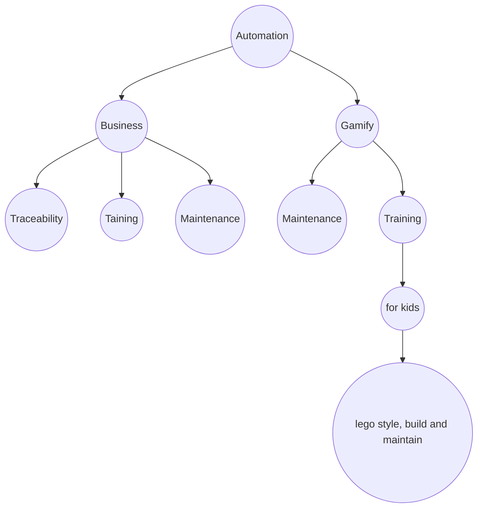

# 🧠 Brainstorming Template for Product/Idea Development

#Context
What inspired this idea? What’s the backstory or environment where this makes sense?

* Maintenance : 

#MainMarket
_Which industry, niche, or category does this idea belong to?_

---

#MainCustomers
_Describe your main audience: who are they, where are they, what do they care about?_

---

#WhoIsThisProductFor
_Be specific. “This is for people who…” (include personas or examples if possible)._

---

#WhoIsThisProductNotFor
_Clarify who you’re not serving to stay focused._

---

#ProblemBeingSolved
_What is the core pain point, need, or desire this product solves?_

---

#UniqueApproach
_What’s different about how you solve the problem? What’s your unfair advantage or innovation?_

---

#CoreValue
_What result, transformation, or experience does the customer actually get?_

---

#MVPIdea
_What’s the smallest version you can build in 7–30 days to test interest or usability?_

---

#RevenuePotential
_Where does the money come from? What’s the pricing model or path to revenue?_

---

#TractionSignals
_Have you seen signs that people want this? (search trends, community questions, competitors)_

---

#Obstacles
_What are the foreseeable technical, market, or personal blockers?_

---

#NextStep
_What is the immediate, no-excuses next action to test or move forward?_

---

#Notes
_Any additional thoughts, inspirations, or references (links, people, posts, etc)._
