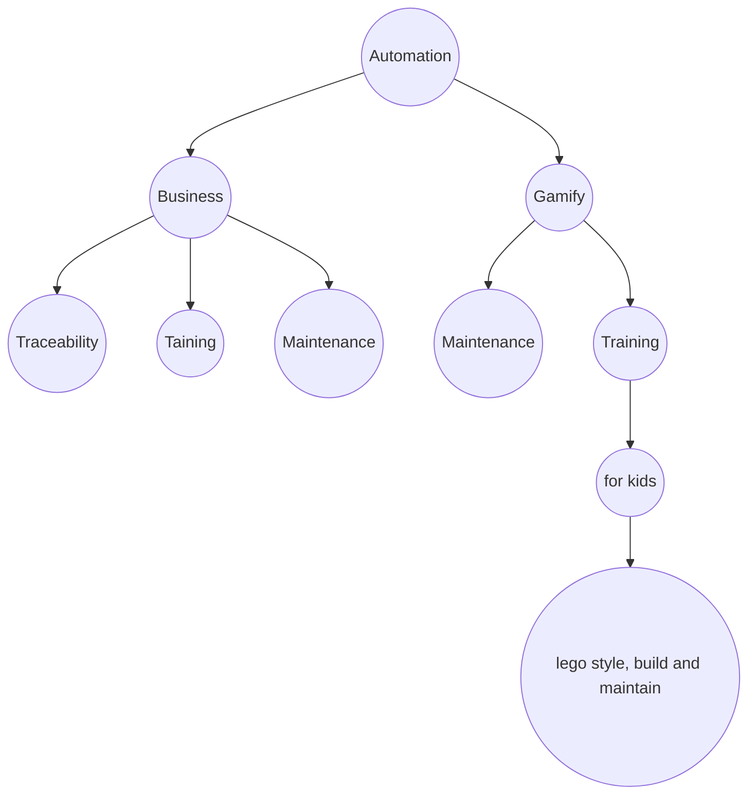

#Context
What inspired this idea? What’s the backstory or environment where this makes sense?

```mermaid
graph TD;

%% Define nodes with labels
id1((Automation))
id2((Business))
id3((Gamify))
id4((Traceability))
id5((Taining))
id6((Maintenance))
id7((Maintenance))
id8((Training))
id9((for kids))
id10((lego style, build and maintain))

%% Define relationships
id1 --> id2
id1 --> id3
id2 --> id4
id2 --> id5
id2 --> id6
id3 --> id7
id3 --> id8
id8 --> id9
id9 --> id10
```

